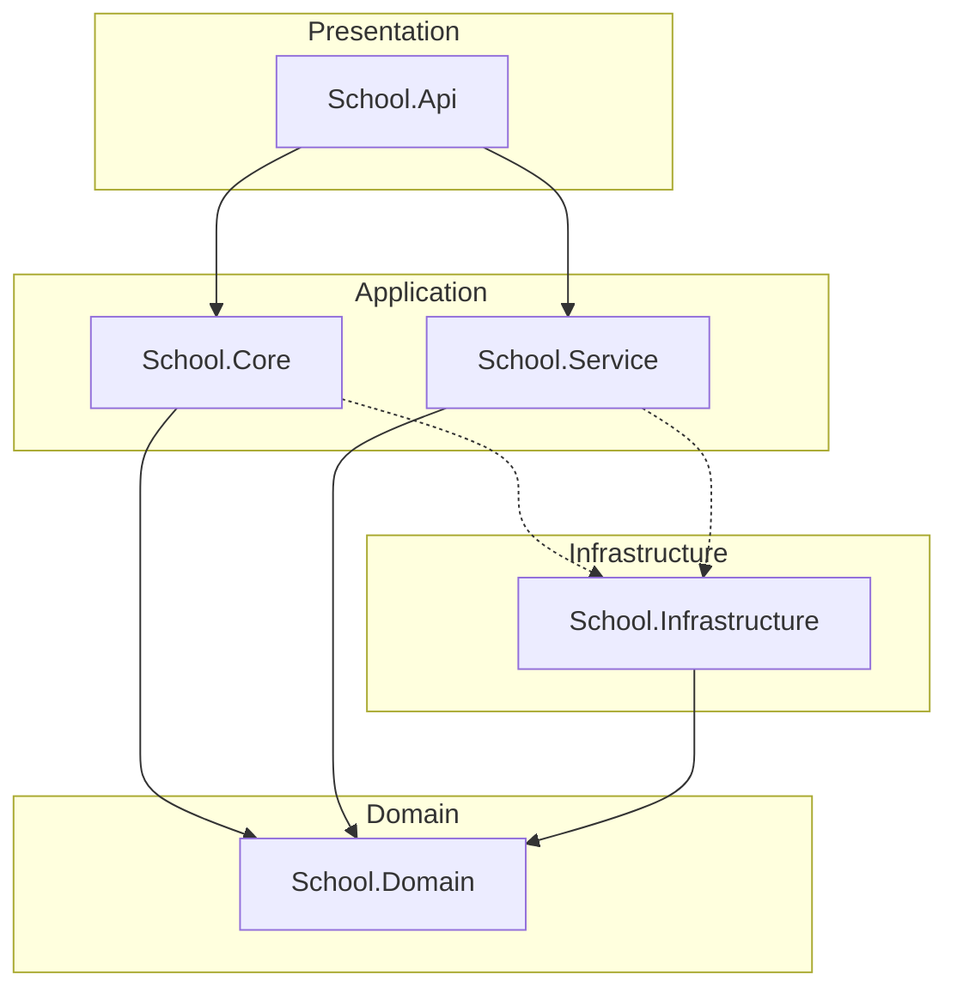

# 🏫 School Management System (Premium Edition)

[](https://dotnet.microsoft.com/)
[](https://docs.microsoft.com/en-us/ef/core/)
[](https://github.com/jbogard/MediatR)
[](https://www.docker.com/)
[](https://opensource.org/licenses/MIT)

A high-performance, enterprise-grade school management backend system. This project is built using **ASP.NET Core 10** and follows strictly the **Clean Architecture** principles, ensuring modularity, scalability, and maintainability.

---

## 🏗️ Architecture Visualization

The system follows a concentric **Clean Architecture** pattern where business rules (Domain) are at the center, and infrastructure/externals are at the periphery.



### Key Design Patterns
- **CQRS (Command Query Responsibility Segregation)**: Implemented using MediatR for clean separation of read and write operations.
- **Repository & Unit of Work**: Abstracting data access and ensuring atomic operations.
- **Dependency Injection**: Decoupled components for better testability and maintenance.
- **Fluent Validation**: Robust input validation through pipeline behaviors.

---

## 🛠️ Technology Stack

| Category | Technology |
| :--- | :--- |
| **Framework** | .NET 10 (ASP.NET Core Web API) |
| **ORM / Data** | Entity Framework Core (SQL Server) |
| **Messaging** | MediatR (CQRS Pattern) |
| **Security** | ASP.NET Core Identity + JWT Bearer + Refresh Tokens |
| **Validation** | FluentValidation |
| **Logging** | Serilog (Sinks: Console, SQL Server) |
| **Documentation**| Swagger UI / OpenAPI |
| **Container** | Docker & Docker Compose |
| **Testing** | xUnit, Moq, FluentAssertions, SQLite In-Memory |

---

## 🚀 Key Features

### 🔐 Security & Identity
- **JWT Authentication**: Full implementation including access/refresh tokens.
- **Role-Based Access Control (RBAC)**: Claims-based and policy-based authorization.
- **Rate Limiting**: Custom middleware to prevent brute-force and DDoS attacks.
- **Auditing**: Comprehensive logging of user actions and system events.

### 📚 Academic Management
- **Student Management**: Full CRUD operations, registration, and profile tracking.
- **Instructor Management**: Expertise tracking, salary management, and department assignment.
- **Department & Subjects**: Complex relationships between departments, students, and instructors.

### 📧 Integrations
- **Email Service**: Robust implementation using **MailKit** for SMTP communication (Gmail ready).
- **Background Tasks**: Capable of handling asynchronous notifications and reminders.

---

## 📂 Project Structure

```bash
📦 SchoolProject
 ┣ 📂 School.Api             # Presentation Layer (REST Controllers, Middleware)
 ┣ 📂 School.Core            # Application Layer (CQRS Features, Commands, Queries)
 ┣ 📂 School.Domain          # Domain Layer (Entities, Constants, Interfaces)
 ┣ 📂 School.Infrastructure  # Infrastructure Layer (DbContext, Identity, Repositories)
 ┣ 📂 School.Service         # Service Layer (Business Services)
 ┣ 📂 School.XUnitTest       # Unit Testing Layer
 ┣ 📂 School.IntegrationTests # Integration Testing Layer
 ┗ 📜 docker-compose.yml     # Environment Configuration
```

---

## 🔧 Getting Started

### Prerequisites
- [.NET 10 SDK](https://dotnet.microsoft.com/download/dotnet/10.0)
- [Docker Desktop](https://www.docker.com/products/docker-desktop/)
- [SQL Server](https://www.microsoft.com/en-us/sql-server/sql-server-downloads) (if running locally)

### Option 1: Running with Docker (Recommended)
This will set up everything including the SQL Server and the API.

```bash
docker-compose up -d --build
```
- **API URL**: `http://localhost:5149`
- **Swagger**: `http://localhost:5149/swagger`

### Option 2: Local Development
1. Update `appsettings.json` with your SQL Server connection string.
2. Run migrations:
   ```bash
   dotnet ef database update --project School.Infrastructure --startup-project School.Api
   ```
3. Launch the API:
   ```bash
   dotnet run --project School.Api
   ```

---

## 🧪 Testing

The solution includes a comprehensive test suite covering unit and integration tests.

```bash
# Run all tests
dotnet test
```

- **Unit Tests**: Focus on business logic in `School.Core` and `School.Service`.
- **Integration Tests**: Verify database interactions and API endpoints using SQLite In-Memory.

---

## 📮 Contact & Support
Developed with ❤️ by **Abdellah Eltrach**.

- **Email**: abdellah.eltrach@gmail.com
- **GitHub**: [abdellaheltrach](https://github.com/abdellaheltrach)

---
*Generated by Antigravity AI Assistant.*
